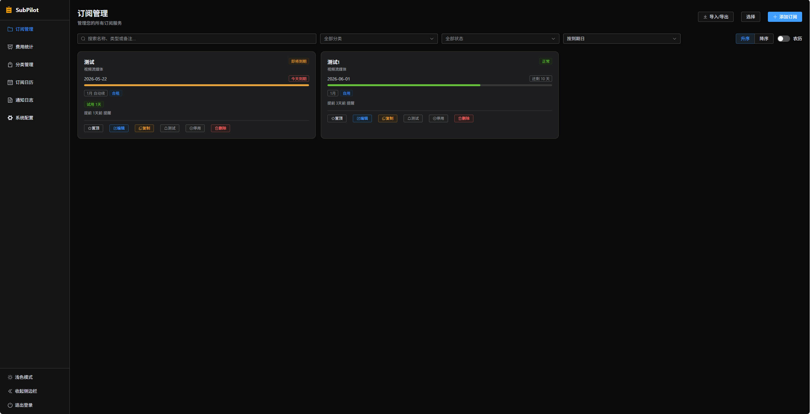
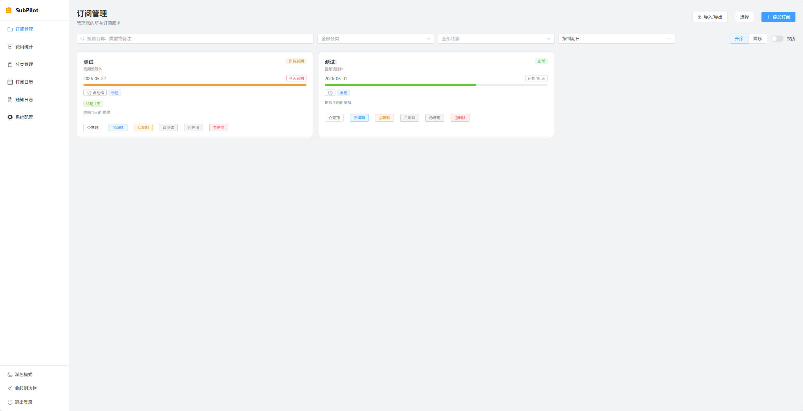
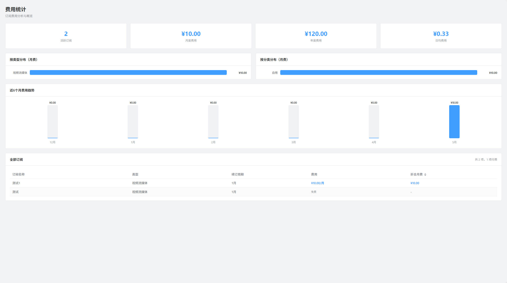
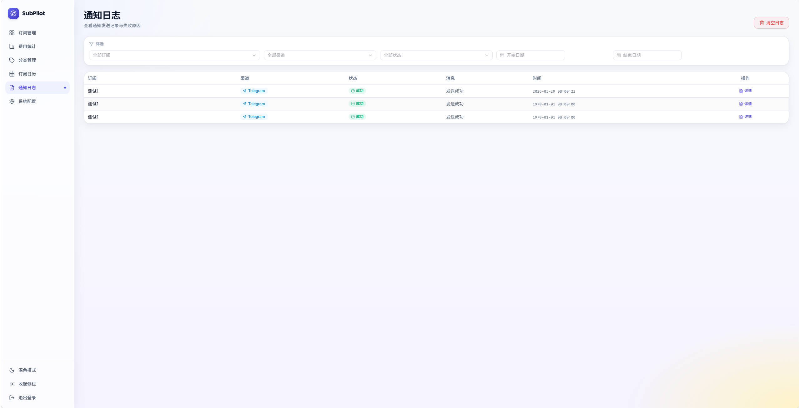
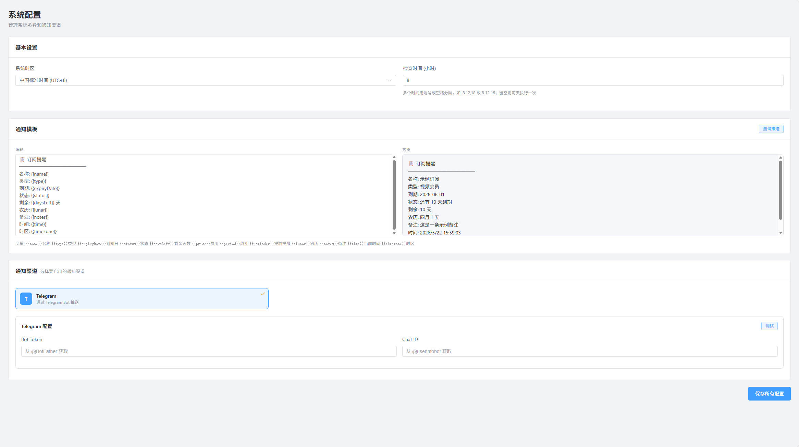
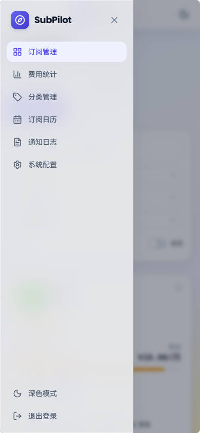

# SubPilot

订阅管理与提醒系统，帮助您集中管理所有订阅服务，到期自动提醒。

## 功能

- **订阅管理** — 卡片网格展示，支持搜索、分类筛选、状态筛选、排序（到期日/名称/创建时间/费用）、置顶
- **日历视图** — 日历上直观查看各订阅到期日，支持农历显示
- **试用期支持** — 订阅可设置免费试用期，到期计算自动叠加试用时长
- **到期提醒** — 通过 Telegram、Bark、PushPlus 等渠道推送到期提醒
- **通知模板** — 自定义通知模板，实时预览，支持名称、类型、到期日、状态、剩余天数、费用、周期、自动续费、农历、备注、时间、时区等变量
- **通知日志** — 查看所有通知发送记录，支持按订阅/渠道/状态/日期筛选
- **导入/导出** — 支持 JSON 和 CSV 格式批量导入导出订阅数据
- **费用统计** — 订阅费用按月/年汇总，按类型和分类分布，费用明细表，支持可搜索多币种选择，每日自动获取汇率换算
- **农历支持** — 日期显示农历，周期可按农历计算
- **深色模式** — 侧边栏一键切换深色/浅色主题
- **响应式布局** — 移动端自适应，侧边栏抽屉模式，日历卡片适配
- **复制订阅** — 快速复制已有订阅，预设 14 种订阅类型
- **现代 UI** — Bento Grid 卡片布局 + Glassmorphism 毛玻璃效果，Lucide 图标，Inter / Poppins / Fira Code 字体
- **双环境部署** — 支持 Docker (Express + SQLite) 和 Cloudflare Workers (Hono + D1)
- **一键部署** — Fork 后 GitHub Actions 自动部署到 Cloudflare Workers + Pages

## 截图

**桌面端**

|                                             |                                        |
| ------------------------------------------- | -------------------------------------- |
|  |  |
|        |
|    |   |

**移动端**

 |

## 技术栈

| 层   | Node.js 版                                                                     | Workers 版                                 |
| ---- | ------------------------------------------------------------------------------ | ------------------------------------------ |
| 前端 | Vue 3、TypeScript、Tailwind CSS、Element Plus、Lucide Icons、Pinia、Vue Router | 同左                                       |
| 后端 | Express、Drizzle ORM、SQLite                                                   | Hono、Drizzle ORM、Cloudflare D1           |
| 部署 | Docker、Docker Compose                                                         | Cloudflare Workers + Pages, GitHub Actions |

## 快速开始

### Docker 部署

需要预先安装 Docker Engine 和 Docker Compose v2（使用 `docker compose` 命令）。

#### 首次部署

```bash
cp .env.example .env
# 编辑 .env 设置 JWT_SECRET 和 ADMIN_PASSWORD
mkdir -p data
docker compose up -d --build
docker compose ps
```

访问 `http://localhost:3000`

容器每次启动时都会自动执行数据库迁移。SQLite 数据保存在项目目录下的
`data/subpilot.db`，重新构建或替换容器不会丢失已有数据。`data/` 已被 Git
和 Docker 构建上下文忽略，请自行将该目录纳入服务器备份。

#### 从旧版命名卷迁移

如果旧版本仍将数据库保存在 `subpilot-data` 命名卷中，拉取新代码后、启动新容器前，
先停止旧容器并复制数据。此操作只需要执行一次：

```bash
git pull
docker stop subpilot
mkdir -p data
docker cp subpilot:/app/data/. ./data
docker compose up -d --build --force-recreate
docker compose ps
```

确认订阅数据正常后可保留旧命名卷作为临时备份。

#### 升级已有部署

已经使用项目 `data/` 目录的版本，可直接拉取新代码并重新构建镜像：

```bash
git pull
docker compose up -d --build
docker compose ps
docker compose logs --tail=100 subpilot
```

如需持续查看运行日志：

```bash
docker compose logs -f subpilot
```

> 请勿删除项目中的 `data/` 目录；Git 不会跟踪其中的数据库文件。

### Cloudflare Workers 部署

#### 一键部署（推荐）

Fork 本仓库后，通过 GitHub Actions 自动部署到 Cloudflare Workers + Pages。

**第一步：创建 Cloudflare 资源**

1. 登录 [Cloudflare Dashboard](https://dash.cloudflare.com)
2. 创建 D1 数据库：左侧菜单 → **Storage & Databases** → **D1 SQL Database** → **Create**，名称填 `subpilot`，创建后进入数据库详情页，复制 **Database ID**
3. 获取 Account ID：左侧菜单 → **Workers & Pages**，在 **Account details** 区域点击 **Click to copy** 复制 Account ID
4. 创建 API Token：点击右上角头像 → **My Profile** → **API Tokens** → **Create Token** → **Get started**，填写 Token 名称，在 **Permissions** 区域添加两条：
   - **Account** → **Cloudflare Workers Scripts** → **Edit**
   - **Account** → **D1** → **Edit**
     点 **Continue to summary** → **Create Token**，**立即复制保存**（只显示一次）

**第二步：配置 GitHub Secrets**

在你的 GitHub 仓库 → **Settings** → **Secrets and variables** → **Actions** 中添加：

| Secret 名称             | 说明                                     |
| ----------------------- | ---------------------------------------- |
| `CLOUDFLARE_API_TOKEN`  | 上一步创建的 API Token                   |
| `CLOUDFLARE_ACCOUNT_ID` | Cloudflare Dashboard 右侧栏的 Account ID |
| `D1_DATABASE_ID`        | 第一步创建的 D1 Database ID              |
| `JWT_SECRET`            | 随机字符串，用于签发登录令牌             |
| `ADMIN_PASSWORD`        | 管理密码（可选，默认 `password`）        |

**第三步：推送到 GitHub**

```bash
git push origin main
```

GitHub Actions 会自动：

- 初始化 D1 数据库表结构
- 部署后端到 Cloudflare Workers
- 自动获取 Workers 地址，构建前端并部署到 Cloudflare Pages

部署完成后访问 `https://你的pages域名.pages.dev`。

<details>
<summary><b>手动部署（不用 GitHub Actions）</b></summary>

**前置条件**

- [Cloudflare 账号](https://dash.cloudflare.com/sign-up)
- 安装 Wrangler CLI：`npm install -g wrangler`
- 登录 Wrangler：`wrangler login`

**1. 创建 D1 数据库**

```bash
cd server
wrangler d1 create subpilot
```

将输出的 `database_id` 填入 `server/wrangler.toml`。

**2. 设置 JWT_SECRET**

在 Cloudflare Dashboard → Workers → Settings → Variables and Secrets 中添加 `JWT_SECRET`（Secret 类型）。

**3. 初始化数据库 + 部署后端**

```bash
cd server
npm install
npx wrangler d1 execute subpilot --file=migrations/0001_init.sql
npx wrangler deploy
```

**4. 部署前端**

```bash
cd client
npm install
VITE_API_URL=https://subpilot.xxx.workers.dev npm run build
npx wrangler pages deploy dist --project-name=subpilot-frontend
```

</details>

### 本地开发

```bash
# Node.js 版
cd server
npm install
cp .env.example .env
npm run dev

# Workers 版（需要先配置 wrangler.toml）
cd server
npm run dev:workers

# 前端（新终端）
cd client
npm install
npm run dev
```

前端 `http://localhost:5173`，后端 `http://localhost:3000`

## 通知渠道

支持通过 Telegram、Bark、PushPlus 等渠道推送到期提醒。在设置页面启用对应渠道并填写 Token、Chat ID 或设备 Key 后即可使用。PushPlus 可选填写群组编码，不填时只推送给自己。

推送时间支持 5 段 Cron 表达式，并按设置的系统时区执行，格式为 `分 时 日 月 周`，支持 `*`、`,`、`-`、`/`，星期字段使用 `1=周日` 到 `7=周六`。例如 `0 8 * * *` 表示每天 08:00，`0 8,18 * * *` 表示每天 08:00 和 18:00。

设置页提供推送运行状态面板，可查看平台上次触发时间、下次计划检查、最近执行结果及匹配/发送数量。“立即执行检查”会绕过 Cron 时间限制，按当前订阅提醒条件执行一次真实推送检查。

## 多币种

支持 160+ 个 ISO 货币代码，币种选择可按代码、中文名、符号和常见别名搜索。汇率通过 [ExchangeRate-API](https://www.exchangerate-api.com/) 每日自动获取，缓存在本地。API 不可用时常用币种自动回退到内置默认汇率。

费用统计页右上角可切换统计目标币种，所有金额按实时汇率折算显示。

## 设计系统

UI 遵循 Bento Grid + Glassmorphism 设计语言，规范文档位于 `client/design-system/MASTER.md`：

- **主色** Indigo `#6366F1`，状态色 Emerald / Amber / Red
- **字体** Heading: Poppins · Body: Inter / Noto Sans SC · 数字: Fira Code (tabular-nums)
- **圆角** 卡片 20px / Bento 24px / 输入框 10px
- **效果** 毛玻璃 `backdrop-blur-xl`、卡片 hover 抬升、渐变背景光晕
- **图标** 全站使用 [Lucide](https://lucide.dev)，不用 emoji

## License

MIT
